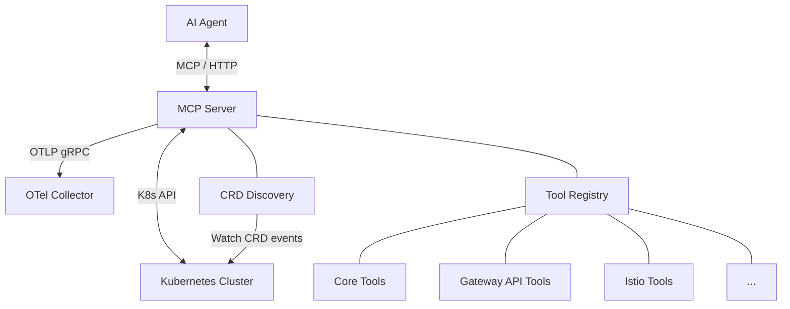

# Architecture

## High-Level Overview



## Components

### MCP Server (`pkg/mcp/`)

Implements the Model Context Protocol using the official `modelcontextprotocol/go-sdk`. Provides Streamable HTTP transport at `/mcp`, handles JSON-RPC 2.0 requests, and manages tool registration. Includes OTel middleware that creates spans for every tool call with GenAI + MCP semantic convention attributes.

### CRD Discovery (`pkg/discovery/`)

Watch-based discovery of installed networking CRDs. On startup, performs a fast scan via `ServerGroups()`. Then watches `customresourcedefinitions` for real-time detection of CRD installations/removals. Triggers tool registration/deregistration via `onChange` callback.

### Tool Registry (`pkg/tools/`)

Thread-safe registry of 52 diagnostic tools. Each tool implements the `Tool` interface:

```go
type Tool interface {
    Name() string
    Description() string
    InputSchema() map[string]interface{}
    Run(ctx context.Context, args map[string]interface{}) (*StandardResponse, error)
}
```

### K8s Client (`pkg/k8s/`)

Kubernetes client setup with three client types: dynamic client (CRD access), typed clientset (core APIs), and discovery client (API discovery). The HTTP transport is wrapped with an OTel tracing round-tripper that automatically creates `k8s.api/{verb}/{resource}` spans for every API call.

### Probe Manager (`pkg/probes/`)

Manages ephemeral diagnostic pod lifecycle with concurrency limits, TTL-based cleanup, and restricted security contexts. Instrumented with OTel spans covering deploy, wait, and cleanup phases.

### Skills Framework (`pkg/skills/`)

Multi-step playbooks that orchestrate multiple tool calls to guide agents through complex networking configurations.

### Telemetry (`pkg/telemetry/`)

Full OpenTelemetry integration with three signal providers (traces, metrics, logs). Initializes TracerProvider, MeterProvider, and LoggerProvider with OTLP gRPC exporters. Provides an slog-OTel bridge for automatic trace_id/span_id correlation in log entries.

## Data Flow

1. Agent sends `tools/call` request via MCP (with optional `traceparent` in `_meta`)
2. MCP server extracts trace context, creates `execute_tool` span
3. Tool executes K8s API queries — each produces a `k8s.api/*` child span
4. Results are formatted as compact markdown tables with severity icons
5. Metrics are recorded (duration, counts, findings, errors)
6. Response is returned to the agent

## Design Decisions

- **Dynamic client over typed clients**: Most resource access uses `dynamic.Interface` for flexibility across CRD versions, with fallback from v1 to v1beta1
- **Watch over polling**: CRD discovery uses K8s watch for instant detection
- **Compact markdown output**: All tools return markdown tables instead of JSON, saving ~3x token cost for LLM agents
- **Ephemeral pods**: Active probing uses pods rather than exec to avoid requiring exec permissions
- **Transport-level tracing**: K8s API spans are injected at the HTTP transport layer, ensuring all API calls are traced without modifying individual tools
- **slog + otelslog**: Standard library structured logging with OTel bridge for automatic trace correlation
- **Noop fallback**: When `OTEL_EXPORTER_OTLP_ENDPOINT` is unset, all OTel providers are noop — zero overhead
