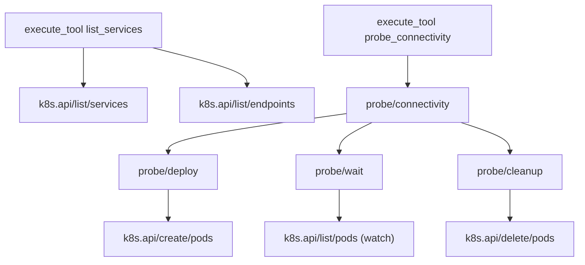
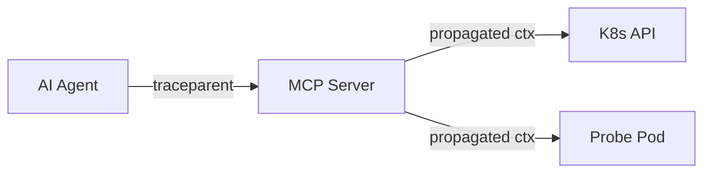

# Observability

mcp-k8s-networking has built-in OpenTelemetry instrumentation that exports all three OTel signals — **traces**, **metrics**, and **logs** — via OTLP gRPC. The instrumentation follows the [OTel GenAI semantic conventions](https://opentelemetry.io/docs/specs/semconv/gen-ai/) and MCP-specific attributes.

## Enabling OTel

### Via Helm

```yaml
otel:
  enabled: true
  endpoint: "otel-collector.observability.svc.cluster.local:4317"
  insecure: true
  serviceName: ""  # defaults to chart fullname
```

### Via Environment Variables

| Variable | Default | Description |
|----------|---------|-------------|
| `OTEL_EXPORTER_OTLP_ENDPOINT` | *(empty = disabled)* | OTLP gRPC endpoint (e.g., `otel-collector:4317`) |
| `OTEL_EXPORTER_OTLP_INSECURE` | `true` | Skip TLS for gRPC connection |
| `OTEL_SERVICE_NAME` | `mcp-k8s-networking` | Service name in resource attributes |

When `OTEL_EXPORTER_OTLP_ENDPOINT` is not set, all telemetry signals use noop providers — zero overhead.

## Traces

The server produces three categories of spans that form a complete trace hierarchy:



### MCP Tool Call Spans

Every MCP tool call produces a span following GenAI + MCP semantic conventions.

- **Span name**: `execute_tool {tool_name}` (e.g., `execute_tool list_services`)
- **Span kind**: `SERVER`

**Attributes:**

| Attribute | Description | Example |
|-----------|-------------|---------|
| `gen_ai.operation.name` | Always `execute_tool` | `execute_tool` |
| `gen_ai.tool.name` | The MCP tool being called | `list_services` |
| `gen_ai.tool.call.arguments` | Sanitized input arguments (secrets redacted) | `{"namespace":"default"}` |
| `gen_ai.tool.call.result` | Truncated response (max 1024 chars) | `{"cluster":"prod",...}` |
| `mcp.method.name` | JSON-RPC method | `tools/call` |
| `mcp.protocol.version` | MCP protocol version | `2025-03-26` |
| `mcp.session.id` | Agent session identifier | `sess_abc123` |
| `error.type` | Error classification (on failure only) | `PROVIDER_NOT_FOUND` |

### K8s API Call Spans

Every Kubernetes API call made by the server automatically produces a child span via an instrumented HTTP transport wrapper on the K8s client.

- **Span name**: `k8s.api/{verb}/{resource}` (e.g., `k8s.api/list/services`, `k8s.api/get/pods`)
- **Span kind**: `CLIENT`

**Attributes:**

| Attribute | Description | Example |
|-----------|-------------|---------|
| `http.request.method` | HTTP method | `GET` |
| `http.response.status_code` | HTTP response status | `200` |
| `k8s.resource.kind` | Kubernetes resource type | `services` |
| `k8s.api.verb` | K8s API verb | `list` |
| `k8s.namespace` | Target namespace (if namespaced) | `default` |
| `k8s.resource.name` | Resource name (if specific) | `my-service` |

**Verb mapping:**

| HTTP Method | With Name | Without Name |
|-------------|-----------|-------------|
| `GET` | `get` | `list` |
| `POST` | — | `create` |
| `PUT` | `update` | — |
| `PATCH` | `patch` | — |
| `DELETE` | `delete` | `deletecollection` |

**Error handling:** Spans are marked ERROR on HTTP 4xx/5xx responses or transport failures.

### Probe Lifecycle Spans

Active probe operations (connectivity, DNS, HTTP) produce a parent span with child spans for each lifecycle phase.

- **Parent span**: `probe/{probe_type}` (e.g., `probe/connectivity`, `probe/dns`, `probe/http`)
- **Child spans**: `probe/deploy`, `probe/wait`, `probe/cleanup`
- **Span kind**: `INTERNAL`

**Parent span attributes:**

| Attribute | Description | Example |
|-----------|-------------|---------|
| `probe.type` | Type of probe | `connectivity` |
| `k8s.namespace` | Namespace where probe pod runs | `mcp-diagnostics` |
| `probe.timeout` | Configured timeout | `10s` |
| `k8s.pod.name` | Created probe pod name | `mcp-probe-connectivity-1710345600-1` |
| `probe.success` | Whether the probe succeeded | `true` |
| `probe.exit_code` | Probe container exit code | `0` |

**Timeout handling:** When a probe times out, a `probe.timeout` span event is recorded on the parent span with the timeout duration, and the span status is set to ERROR.

**Cleanup span:** The `probe/cleanup` span always runs, even after timeout, to track pod deletion.

### Context Propagation

The server extracts W3C Trace Context (`traceparent`/`tracestate`) from `params._meta` in each MCP request. This enables **end-to-end traces** spanning:



If your AI agent sets `traceparent` in the `_meta` field of tool call requests, the MCP server will join those traces automatically. Probe pods also receive the `TRACEPARENT` environment variable for correlation.

### Error Spans

When a tool call fails:

- Span status is set to `ERROR`
- `error.type` is set to the MCPError code (e.g., `PROVIDER_NOT_FOUND`, `INVALID_INPUT`, `PROBE_TIMEOUT`) or `tool_error` for unclassified failures
- The error is recorded as a span event with the full error message

## Metrics

### GenAI Semantic Convention Metrics

| Metric | Type | Unit | Dimensions | Description |
|--------|------|------|------------|-------------|
| `gen_ai.server.request.duration` | Histogram | seconds | `gen_ai.tool.name`, `error.type` | Tool call execution duration |
| `gen_ai.server.request.count` | Counter | — | `gen_ai.tool.name`, `error.type` | Number of tool call requests |

### Custom Domain Metrics

| Metric | Type | Dimensions | Description |
|--------|------|------------|-------------|
| `mcp.findings.total` | Counter | `severity`, `analyzer` | Diagnostic findings emitted (per severity and tool) |
| `mcp.errors.total` | Counter | `error.code`, `gen_ai.tool.name` | Tool execution errors (per error code and tool) |

### Example Queries

**Average tool call duration by tool (PromQL):**
```promql
histogram_quantile(0.95, rate(gen_ai_server_request_duration_bucket[5m]))
```

**Error rate by tool:**
```promql
rate(gen_ai_server_request_count{error_type!=""}[5m])
/ rate(gen_ai_server_request_count[5m])
```

**Critical findings spike:**
```promql
rate(mcp_findings_total{severity="critical"}[5m])
```

**Slowest K8s API calls (from trace data):**

Use your tracing backend to query spans with name matching `k8s.api/*` and sort by duration to find slow API calls bottlenecking tool execution.

## Logs

When OTel is enabled, structured logs (via Go's `slog`) are bridged to OTel Logs using `otelslog`. Every log entry emitted within an active span context is automatically enriched with:

- `trace_id` — links to the parent trace
- `span_id` — links to the specific span

This enables **log-to-trace correlation** in observability platforms — click a log entry to jump to its full trace.

### Log Format

Logs are JSON-structured:

```json
{
  "time": "2026-02-25T10:30:00Z",
  "level": "INFO",
  "msg": "tool execution completed",
  "tool_name": "list_services",
  "trace_id": "4bf92f3577b34da6a3ce929d0e0e4736",
  "span_id": "00f067aa0ba902b7"
}
```

When OTel is disabled, logs are still JSON-structured but without `trace_id`/`span_id` fields.

## Backend Integration Examples

### OTel Collector (In-Cluster)

Deploy an OTel Collector in the `observability` namespace:

```yaml
# otel-collector.yaml
apiVersion: v1
kind: ConfigMap
metadata:
  name: otel-collector-config
  namespace: observability
data:
  config.yaml: |
    receivers:
      otlp:
        protocols:
          grpc:
            endpoint: 0.0.0.0:4317
    exporters:
      debug:
        verbosity: detailed
    service:
      pipelines:
        traces:
          receivers: [otlp]
          exporters: [debug]
        metrics:
          receivers: [otlp]
          exporters: [debug]
        logs:
          receivers: [otlp]
          exporters: [debug]
```

Then set the Helm value:

```yaml
otel:
  enabled: true
  endpoint: "otel-collector.observability.svc.cluster.local:4317"
```

### Jaeger

Export traces to Jaeger via the OTel Collector:

```yaml
exporters:
  otlp/jaeger:
    endpoint: jaeger-collector.observability.svc.cluster.local:4317
    tls:
      insecure: true

service:
  pipelines:
    traces:
      receivers: [otlp]
      exporters: [otlp/jaeger]
```

### Grafana (Tempo + Mimir + Loki)

Export all three signals to the Grafana stack:

```yaml
exporters:
  otlphttp/tempo:
    endpoint: http://tempo.observability.svc.cluster.local:4318
  prometheusremotewrite:
    endpoint: http://mimir.observability.svc.cluster.local/api/v1/push
  loki:
    endpoint: http://loki.observability.svc.cluster.local:3100/loki/api/v1/push

service:
  pipelines:
    traces:
      receivers: [otlp]
      exporters: [otlphttp/tempo]
    metrics:
      receivers: [otlp]
      exporters: [prometheusremotewrite]
    logs:
      receivers: [otlp]
      exporters: [loki]
```

### Dynatrace

Export directly to Dynatrace via OTLP:

```yaml
exporters:
  otlphttp/dynatrace:
    endpoint: "https://{your-environment-id}.live.dynatrace.com/api/v2/otlp"
    headers:
      Authorization: "Api-Token {your-api-token}"

service:
  pipelines:
    traces:
      receivers: [otlp]
      exporters: [otlphttp/dynatrace]
    metrics:
      receivers: [otlp]
      exporters: [otlphttp/dynatrace]
    logs:
      receivers: [otlp]
      exporters: [otlphttp/dynatrace]
```

Or point the MCP server directly to the Dynatrace OTLP endpoint:

```yaml
otel:
  enabled: true
  endpoint: "https://{your-environment-id}.live.dynatrace.com/api/v2/otlp"
  insecure: false
```

## Complete Span Reference

Every registered tool produces an `execute_tool` span. K8s API calls within each tool produce `k8s.api/*` child spans. Probe tools additionally produce `probe/*` lifecycle spans.

### Always Available Tools

| Tool | Tool Span | Child Spans |
|------|-----------|-------------|
| `list_services` | `execute_tool list_services` | `k8s.api/list/services`, `k8s.api/list/endpoints` |
| `get_service` | `execute_tool get_service` | `k8s.api/get/services`, `k8s.api/list/pods` |
| `list_endpoints` | `execute_tool list_endpoints` | `k8s.api/list/endpoints` |
| `list_networkpolicies` | `execute_tool list_networkpolicies` | `k8s.api/list/networkpolicies` |
| `get_networkpolicy` | `execute_tool get_networkpolicy` | `k8s.api/get/networkpolicies` |
| `check_dns_resolution` | `execute_tool check_dns_resolution` | `k8s.api/list/pods` |
| `check_kube_proxy_health` | `execute_tool check_kube_proxy_health` | `k8s.api/list/daemonsets`, `k8s.api/list/pods` |
| `list_ingresses` | `execute_tool list_ingresses` | `k8s.api/list/ingresses` |
| `get_ingress` | `execute_tool get_ingress` | `k8s.api/get/ingresses` |
| `check_dataplane_health` | `execute_tool check_dataplane_health` | `k8s.api/list/pods` |
| `check_rate_limit_policies` | `execute_tool check_rate_limit_policies` | `k8s.api/list/*` (varies by provider) |
| `get_proxy_logs` | `execute_tool get_proxy_logs` | `k8s.api/get/pods` |
| `get_gateway_logs` | `execute_tool get_gateway_logs` | `k8s.api/list/pods` |
| `get_infra_logs` | `execute_tool get_infra_logs` | `k8s.api/list/pods` |
| `analyze_log_errors` | `execute_tool analyze_log_errors` | `k8s.api/get/pods` |
| `probe_connectivity` | `execute_tool probe_connectivity` | `probe/connectivity` → `probe/deploy`, `probe/wait`, `probe/cleanup` |
| `probe_dns` | `execute_tool probe_dns` | `probe/dns` → `probe/deploy`, `probe/wait`, `probe/cleanup` |
| `probe_http` | `execute_tool probe_http` | `probe/http` → `probe/deploy`, `probe/wait`, `probe/cleanup` |
| `list_skills` | `execute_tool list_skills` | — |
| `run_skill` | `execute_tool run_skill` | varies by skill |
| `suggest_remediation` | `execute_tool suggest_remediation` | `k8s.api/*` (varies) |

### CRD-Dependent Tools

| Tool | Requires | Tool Span |
|------|----------|-----------|
| `list_gateways` | Gateway API | `execute_tool list_gateways` |
| `get_gateway` | Gateway API | `execute_tool get_gateway` |
| `list_httproutes` | Gateway API | `execute_tool list_httproutes` |
| `get_httproute` | Gateway API | `execute_tool get_httproute` |
| `list_grpcroutes` | Gateway API | `execute_tool list_grpcroutes` |
| `get_grpcroute` | Gateway API | `execute_tool get_grpcroute` |
| `list_referencegrants` | Gateway API | `execute_tool list_referencegrants` |
| `get_referencegrant` | Gateway API | `execute_tool get_referencegrant` |
| `scan_gateway_misconfigs` | Gateway API | `execute_tool scan_gateway_misconfigs` |
| `check_gateway_conformance` | Gateway API | `execute_tool check_gateway_conformance` |
| `design_gateway_api` | Gateway API | `execute_tool design_gateway_api` |
| `list_istio_resources` | Istio | `execute_tool list_istio_resources` |
| `get_istio_resource` | Istio | `execute_tool get_istio_resource` |
| `check_sidecar_injection` | Istio | `execute_tool check_sidecar_injection` |
| `check_istio_mtls` | Istio | `execute_tool check_istio_mtls` |
| `validate_istio_config` | Istio | `execute_tool validate_istio_config` |
| `analyze_istio_authpolicy` | Istio | `execute_tool analyze_istio_authpolicy` |
| `analyze_istio_routing` | Istio | `execute_tool analyze_istio_routing` |
| `design_istio` | Istio | `execute_tool design_istio` |
| `list_kgateway_resources` | kgateway | `execute_tool list_kgateway_resources` |
| `validate_kgateway_resource` | kgateway | `execute_tool validate_kgateway_resource` |
| `check_kgateway_health` | kgateway | `execute_tool check_kgateway_health` |
| `design_kgateway` | kgateway | `execute_tool design_kgateway` |
| `check_kuma_status` | Kuma | `execute_tool check_kuma_status` |
| `check_linkerd_status` | Linkerd | `execute_tool check_linkerd_status` |
| `list_cilium_policies` | Cilium | `execute_tool list_cilium_policies` |
| `get_cilium_policy` | Cilium | `execute_tool get_cilium_policy` |
| `check_cilium_status` | Cilium | `execute_tool check_cilium_status` |
| `list_calico_policies` | Calico | `execute_tool list_calico_policies` |
| `check_calico_status` | Calico | `execute_tool check_calico_status` |
| `check_flannel_status` | Flannel | `execute_tool check_flannel_status` |
